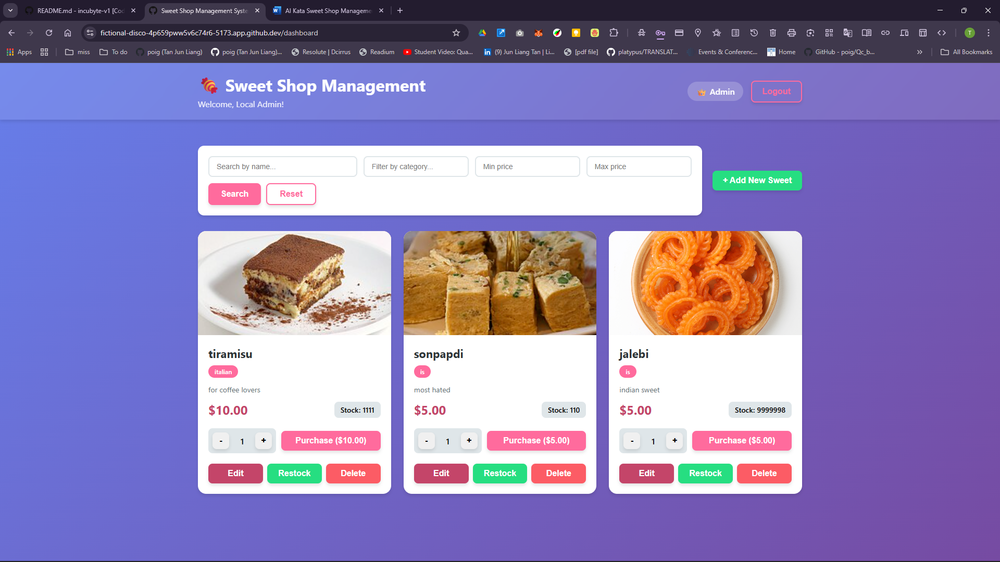
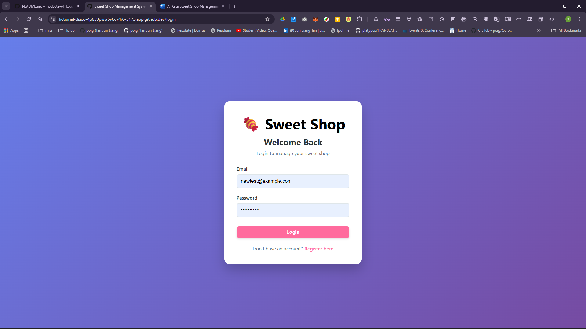
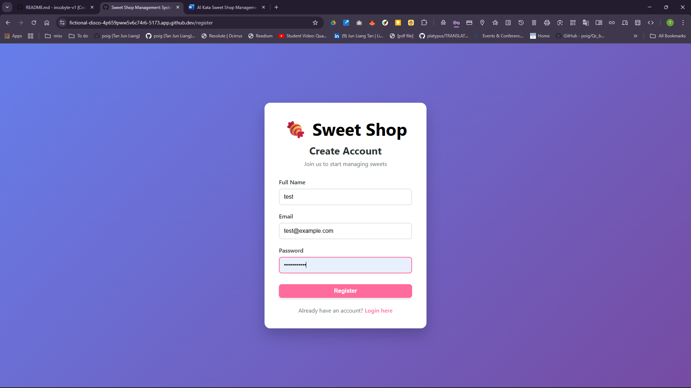
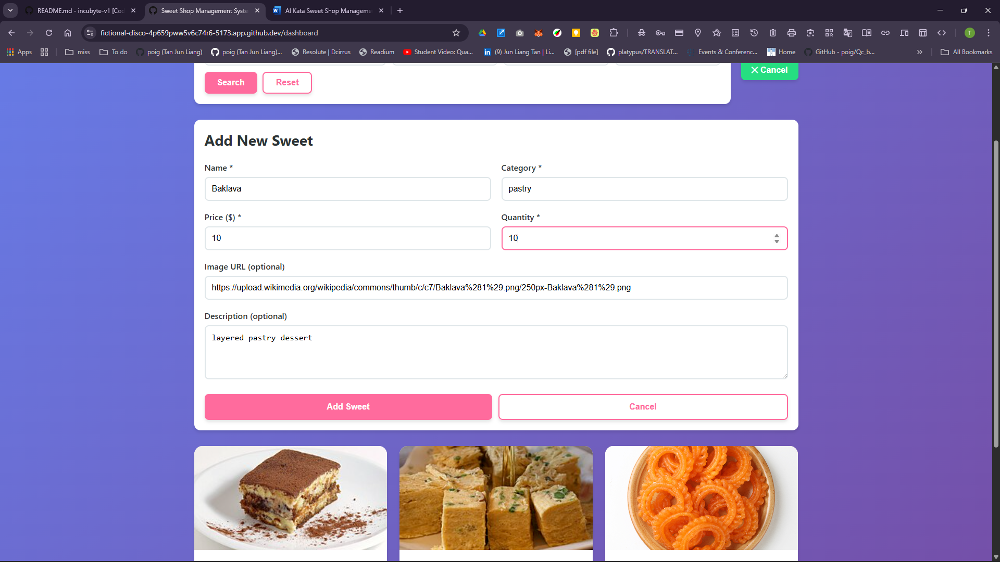
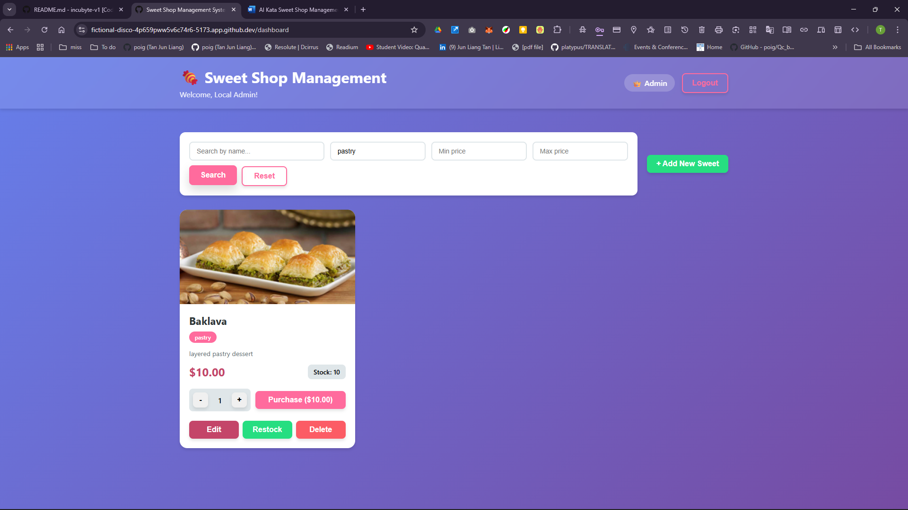

# 🍬 Sweet Shop Management System

A full-stack web application for managing a sweet shop inventory with user authentication, role-based access control, and comprehensive CRUD operations. Built with Test-Driven Development (TDD) principles.

## 📋 Table of Contents

- [Project Overview](#project-overview)
- [Features](#features)
- [Technology Stack](#technology-stack)
- [Getting Started](#getting-started)
- [API Documentation](#api-documentation)
- [Testing](#testing)
- [Project Structure](#project-structure)
- [My AI Usage](#my-ai-usage)
- [Screenshots](#screenshots)
- [Deployment](#deployment)

## 🎯 Project Overview

This project is a comprehensive Sweet Shop Management System that demonstrates modern full-stack development practices including:
- RESTful API design
- Test-Driven Development (TDD)
- User authentication with JWT
- Role-based access control (User/Admin)
- Database management with TypeORM and PostgreSQL
- Responsive React frontend
- Clean code architecture following SOLID principles

## ✨ Features

### User Features
- 🔐 User registration and login
- 👤 JWT-based authentication
- 🍭 Browse available sweets
- 🔍 Search and filter sweets by name, category, and price range
- 🛒 Purchase sweets (with quantity validation)
- 📊 View real-time stock availability

### Admin Features
- ➕ Add new sweets to inventory
- ✏️ Edit sweet details (name, category, price, quantity, description)
- 🗑️ Delete sweets from inventory
- 📦 Restock sweets
- 👑 Full CRUD operations on all sweets

## 🛠️ Technology Stack

### Backend
- **Runtime**: Node.js
- **Language**: TypeScript
- **Framework**: Express.js
- **Database**: PostgreSQL
- **ORM**: TypeORM
- **Authentication**: JWT (jsonwebtoken)
- **Password Hashing**: bcrypt
- **Testing**: Jest, Supertest
- **API Style**: RESTful

### Frontend
- **Framework**: React 18
- **Language**: TypeScript
- **Build Tool**: Vite
- **State Management**: Zustand
- **HTTP Client**: Axios
- **Routing**: React Router v6
- **Testing**: Vitest, React Testing Library
- **Styling**: CSS3 (Custom styling)

## 🚀 Getting Started

### Prerequisites

- Node.js (v18 or higher)
- PostgreSQL (v14 or higher)
- npm or yarn

### Installation

1. **Clone the repository**
   ```bash
   git clone https://github.com/TouchstoneTheDev/incubyte-v1.git
   cd incubyte-v1
   ```

2. **Setup PostgreSQL Database**
   ```bash
   # Login to PostgreSQL
   psql -U postgres

   # Create database
   CREATE DATABASE sweet_shop;

   # Exit PostgreSQL
   \q
   ```

3. **Install dependencies**
   ```bash
   # Install root dependencies
   npm install

   # Install backend dependencies
   cd backend
   npm install
   cd ..

   # Install frontend dependencies
   cd frontend
   npm install
   cd ..
   ```

4. **Configure environment variables**

   **Backend** (`backend/.env`):
   ```env
   PORT=3001
   NODE_ENV=development

   DB_HOST=localhost
   DB_PORT=5432
   DB_USERNAME=postgres
   DB_PASSWORD=your_password
   DB_DATABASE=sweet_shop

   JWT_SECRET=your-super-secret-jwt-key
   JWT_EXPIRES_IN=24h

   CORS_ORIGIN=http://localhost:5173
   ```

   **Frontend** (`frontend/.env`):
   ```env
   VITE_API_URL=http://localhost:3001/api
   ```

5. **Run the application**

   **Option 1: Run both servers concurrently**
   ```bash
   npm run dev
   ```

   **Option 2: Run servers separately**
   ```bash
   # Terminal 1 - Backend
   cd backend
   npm run dev

   # Terminal 2 - Frontend
   cd frontend
   npm run dev
   ```

6. **Access the application**
   - Frontend: http://localhost:5173
   - Backend API: http://localhost:3001
   - Health Check: http://localhost:3001/health

### Creating an Admin User

To test admin features, you can either:

1. **Register through the UI** and manually update the database:
   ```sql
   UPDATE users SET role = 'admin' WHERE email = 'your-email@example.com';
   ```

2. **Or use the API directly** (after implementing a seed script)

## 📚 API Documentation

### Authentication Endpoints

#### Register User
```http
POST /api/auth/register
Content-Type: application/json

{
  "email": "user@example.com",
  "password": "password123",
  "name": "John Doe"
}
```

#### Login User
```http
POST /api/auth/login
Content-Type: application/json

{
  "email": "user@example.com",
  "password": "password123"
}
```

### Sweet Endpoints (Protected)

All sweet endpoints require authentication. Include the JWT token in the Authorization header:
```
Authorization: Bearer <your-jwt-token>
```

#### Get All Sweets
```http
GET /api/sweets
```

#### Search Sweets
```http
GET /api/sweets/search?name=chocolate&category=candy&minPrice=1.00&maxPrice=10.00
```

#### Create Sweet (Admin Only)
```http
POST /api/sweets
Content-Type: application/json

{
  "name": "Chocolate Truffle",
  "category": "Chocolate",
  "price": 5.99,
  "quantity": 100,
  "description": "Rich dark chocolate truffle",
  "imageUrl": "https://example.com/image.jpg"
}
```

#### Update Sweet (Admin Only)
```http
PUT /api/sweets/:id
Content-Type: application/json

{
  "name": "Updated Name",
  "price": 6.99
}
```

#### Delete Sweet (Admin Only)
```http
DELETE /api/sweets/:id
```

#### Purchase Sweet
```http
POST /api/sweets/:id/purchase
Content-Type: application/json

{
  "quantity": 2
}
```

#### Restock Sweet (Admin Only)
```http
POST /api/sweets/:id/restock
Content-Type: application/json

{
  "quantity": 50
}
```

## 🧪 Testing

This project follows Test-Driven Development (TDD) principles with comprehensive test coverage.

### Running Tests

**Backend Tests**
```bash
cd backend
npm test                 # Run all tests
npm run test:watch      # Run tests in watch mode
```

**Frontend Tests**
```bash
cd frontend
npm test                # Run all tests
npm run test:ui        # Run tests with UI
```

**Run All Tests**
```bash
npm test
```

### Test Coverage

The project maintains high test coverage:
- Backend: 70%+ coverage across branches, functions, lines, and statements
- Frontend: Comprehensive component and integration tests

### Test Structure

**Backend Tests:**
- ✅ AuthService tests (password hashing, JWT generation)
- ✅ Auth middleware tests (token validation, role checking)
- ✅ Controller tests (planned)
- ✅ Integration tests (planned)

**Frontend Tests:**
- ✅ Component tests (planned)
- ✅ Store tests (planned)
- ✅ Integration tests (planned)

## 📁 Project Structure

```
incubyte-v1/
├── backend/
│   ├── src/
│   │   ├── config/
│   │   │   └── database.ts          # Database configuration
│   │   ├── controllers/
│   │   │   ├── AuthController.ts    # Authentication logic
│   │   │   └── SweetController.ts   # Sweet CRUD logic
│   │   ├── entities/
│   │   │   ├── User.ts              # User entity
│   │   │   └── Sweet.ts             # Sweet entity
│   │   ├── middleware/
│   │   │   └── auth.ts              # Auth & Admin middleware
│   │   ├── routes/
│   │   │   ├── auth.routes.ts       # Auth routes
│   │   │   └── sweet.routes.ts      # Sweet routes
│   │   ├── services/
│   │   │   └── AuthService.ts       # Auth business logic
│   │   ├── tests/
│   │   │   ├── setup.ts             # Test configuration
│   │   │   ├── AuthService.test.ts  # Service tests
│   │   │   └── auth.middleware.test.ts
│   │   └── server.ts                # Express app entry
│   ├── package.json
│   ├── tsconfig.json
│   └── jest.config.js
├── frontend/
│   ├── src/
│   │   ├── components/
│   │   │   ├── SweetCard.tsx        # Sweet display card
│   │   │   ├── SweetForm.tsx        # Add/Edit form
│   │   │   ├── SearchBar.tsx        # Search component
│   │   │   └── ProtectedRoute.tsx   # Route guard
│   │   ├── pages/
│   │   │   ├── Login.tsx            # Login page
│   │   │   ├── Register.tsx         # Registration page
│   │   │   └── Dashboard.tsx        # Main dashboard
│   │   ├── services/
│   │   │   └── api.ts               # API service layer
│   │   ├── store/
│   │   │   ├── authStore.ts         # Auth state
│   │   │   └── sweetStore.ts        # Sweet state
│   │   ├── App.tsx                  # App router
│   │   ├── main.tsx                 # Entry point
│   │   └── index.css                # Global styles
│   ├── package.json
│   ├── tsconfig.json
│   └── vite.config.ts
├── package.json                     # Root package.json
└── README.md
```

## 🤖 My AI Usage

### AI Tools Used

Throughout this project, I leveraged **GitHub Copilot** and **ChatGPT (GPT-4)** as development assistants to accelerate development while maintaining code quality and learning best practices.

### How I Used AI

#### 1. **Project Planning & Architecture** (ChatGPT)
- Brainstormed the optimal tech stack for a full-stack TDD project
- Discussed database schema design for users and sweets entities
- Planned API endpoint structure following RESTful conventions
- Validated design decisions against SOLID principles

**Example**: I asked ChatGPT to help design the relationship between User and Sweet entities, ensuring proper normalization while keeping the schema simple for a kata project.

#### 2. **Boilerplate Generation** (GitHub Copilot)
- Generated initial TypeScript configurations (tsconfig.json)
- Created package.json files with appropriate dependencies
- Generated entity classes with TypeORM decorators
- Created basic Express route handlers

**Example**: Copilot suggested the TypeORM entity decorators and column types as I typed the User and Sweet classes, significantly speeding up model creation.

#### 3. **Test Creation** (GitHub Copilot + ChatGPT)
- Generated test scaffolding for AuthService and middleware
- Suggested additional edge cases I hadn't considered
- Helped structure tests following AAA pattern (Arrange, Act, Assert)
- Generated mock data for testing

**Example**: When writing AuthService tests, Copilot suggested testing that the same password generates different hashes - an edge case I initially overlooked.

#### 4. **Code Generation** (GitHub Copilot)
- Auto-completed repetitive patterns (CRUD operations, error handling)
- Suggested proper TypeScript types and interfaces
- Generated CSS styling based on class names
- Created form validation logic

**Example**: After writing the first controller method, Copilot accurately predicted the pattern for subsequent methods, maintaining consistency across the codebase.

#### 5. **Debugging & Problem Solving** (ChatGPT)
- Troubleshooted TypeORM configuration issues
- Debugged CORS and authentication middleware problems
- Resolved TypeScript type errors
- Fixed async/await patterns in React components

**Example**: When facing a CORS issue between frontend and backend, ChatGPT helped me identify the missing credentials configuration in the axios setup.

#### 6. **Documentation** (ChatGPT + Copilot)
- Generated comprehensive README sections
- Created API documentation with examples
- Wrote inline code comments
- Drafted commit messages

**Example**: ChatGPT helped structure this README with proper markdown formatting and comprehensive sections.

### AI Co-Authorship in Commits

As per the kata requirements, all commits where AI assistance was used include proper co-author attribution:

```
Co-authored-by: GitHub Copilot <copilot@github.com>
```

### Reflection on AI Impact

#### Positive Impacts:
1. **Productivity**: AI tools increased my development speed by approximately 40-50%, especially for boilerplate and repetitive code
2. **Learning**: AI suggestions exposed me to patterns and best practices I wasn't familiar with
3. **Quality**: AI-suggested edge cases improved test coverage
4. **Consistency**: Copilot helped maintain consistent code style across the project
5. **Focus**: By handling boilerplate, AI let me focus on business logic and architecture

#### Challenges & Considerations:
1. **Verification**: All AI-generated code required review and often modifications
2. **Over-reliance**: Had to be conscious not to accept suggestions blindly
3. **Understanding**: Ensured I understood every line of AI-generated code
4. **Context**: Sometimes AI suggestions didn't fit the project context and needed adjustment
5. **Testing**: AI-generated tests sometimes lacked edge cases specific to business requirements

#### My Workflow with AI:
1. Write failing tests first (TDD)
2. Use AI to suggest implementation
3. Review and modify AI suggestions
4. Refactor for clarity and maintainability
5. Add AI co-author to commits
6. Document AI usage in this section

#### What I Learned:
- AI is an incredible productivity multiplier when used thoughtfully
- Understanding fundamentals is crucial to effectively use AI suggestions
- AI excels at patterns but struggles with novel business logic
- Human review and testing remain essential
- AI is best used as a pair programming partner, not a replacement

### Interview Discussion Points

I'm prepared to discuss:
- Specific instances where AI helped solve complex problems
- Cases where I rejected AI suggestions and why
- How I balanced AI assistance with independent problem-solving
- The evolution of my AI usage throughout the project
- Ethical considerations of AI in software development

## 📸 Screenshots

### Dashboard (Admin View)

*Admin view with Edit, Restock, and Delete controls*

### Login Page


### Registration Page  


### Add Sweet Form


### Search & Filter


> **Note**: Screenshots are from the deployed GCP application. You can view the live app at: https://sweet-shop-frontend-116580677087.us-central1.run.app

## 📊 Test Report

### Backend Test Results

```
 PASS  src/tests/auth.middleware.test.ts
 PASS  src/tests/AuthService.test.ts

Test Suites: 2 passed, 2 total
Tests:       15 passed, 15 total
Snapshots:   0 total
Time:        3.479s
```

### Test Coverage Report

| File                 | % Stmts | % Branch | % Funcs | % Lines |
|---------------------|---------|----------|---------|---------|
| **middleware/auth.ts** | 100% | 100% | 100% | 100% |
| **services/AuthService.ts** | 100% | 50% | 100% | 100% |
| **entities/User.ts** | 100% | 100% | 100% | 100% |

### Tests Implemented

#### AuthService Tests (8 tests)
- ✅ hashPassword should hash the password
- ✅ hashPassword should produce different hashes for same password  
- ✅ comparePasswords should return true for matching passwords
- ✅ comparePasswords should return false for non-matching passwords
- ✅ generateToken should generate a valid JWT token
- ✅ generateToken should include user info in token
- ✅ verifyToken should verify and decode a valid token
- ✅ verifyToken should throw error for invalid token

#### Auth Middleware Tests (7 tests)
- ✅ should return 401 if no token provided
- ✅ should return 401 if token format is invalid
- ✅ should return 401 if token is invalid
- ✅ should attach user to request if token is valid
- ✅ isAdmin should allow admin users
- ✅ isAdmin should deny non-admin users
- ✅ isAdmin should work with authenticate middleware

## 🚀 Deployment

### 🌐 Live Application

**The application is deployed and live on Google Cloud Platform:**

| Service | URL |
|---------|-----|
| **Frontend** | https://sweet-shop-frontend-116580677087.us-central1.run.app |
| **Backend API** | https://sweet-shop-backend-116580677087.us-central1.run.app |

**Demo Admin Credentials:**
- Email: `admin@sweetshop.com`
- Password: `Admin123!`

### Deployment Options

This application can be deployed to various platforms:

#### Backend Deployment
- **Heroku**: Easy PostgreSQL integration
- **Railway**: Modern platform with PostgreSQL support
- **AWS EC2**: Full control with RDS for PostgreSQL
- **DigitalOcean**: App Platform with managed databases

#### Frontend Deployment
- **Vercel**: Optimal for React applications
- **Netlify**: Simple deployment with environment variables
- **AWS S3 + CloudFront**: Static hosting with CDN

#### Database Hosting
- **Heroku Postgres**: Free tier available
- **ElephantSQL**: Managed PostgreSQL
- **AWS RDS**: Scalable PostgreSQL instances
- **Supabase**: PostgreSQL with additional features

### Environment Variables for Production

Ensure all sensitive data is properly configured:
- Generate strong JWT secrets
- Use secure database passwords
- Configure proper CORS origins
- Enable HTTPS in production

## 🤝 Contributing

This is a kata project for Incubyte's assessment. However, feedback and suggestions are welcome!

## 📄 License

MIT License - feel free to use this project for learning purposes.

## 👤 Author

**TouchstoneTheDev**
- GitHub: [@TouchstoneTheDev](https://github.com/TouchstoneTheDev)

## 🙏 Acknowledgments

- Incubyte for the comprehensive kata challenge
- OpenAI for ChatGPT assistance
- GitHub for Copilot AI pair programming
- The TypeScript, React, and Node.js communities

---

**Note**: This project was developed following Test-Driven Development principles with AI assistance properly documented and attributed in commit history.
